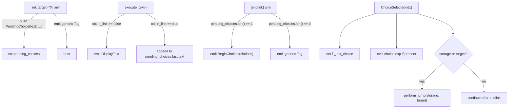

# Fix Choice System (3 Bugs)

## Files changed

- `[kag-interpreter/src/runtime/executor.rs](kag-interpreter/src/runtime/executor.rs)` — Fix 1 + Fix 2
- `[kag-interpreter/src/runtime/mod.rs](kag-interpreter/src/runtime/mod.rs)` — Fix 2 + Fix 3

---

## Data flow after the fixes




---

## Fix 1 — Accumulate link text into `PendingChoice` (`executor.rs`)

**Problem:** In `execute_text` (line 121), all parts produce `DisplayText` events regardless of `ctx.in_link`. `PendingChoice.text` stays `""`.

**Change:** When `ctx.in_link` is `true`, redirect text output into `ctx.pending_choices.last_mut().text` instead of emitting `DisplayText` events. The inline-tag flush points do the same redirection.

```rust
// at both flush points (inline tag flush + end-of-parts flush):
if ctx.in_link {
    if let Some(c) = ctx.pending_choices.last_mut() {
        c.text.push_str(&text_buf);
    }
    text_buf.clear();
} else {
    events.push(KagEvent::DisplayText { text: take(&mut text_buf), .. });
}
```

Inline tags within link text (e.g. `[eval]`) still execute for side-effects; only display events are suppressed.

---

## Fix 2 — Single-choice `[endlink]` (`executor.rs`)

**Problem:** Line 360: `if ctx.pending_choices.len() >= 2` silently discards single-choice links.

**Change:** Lower the threshold to `>= 1`.

```rust
// before
if ctx.pending_choices.len() >= 2 {

// after
if ctx.pending_choices.len() >= 1 {
```

---

## Fix 3 — Navigate after `ChoiceSelected` (`mod.rs`)

**Problem:** Lines 292–305: after `ChoiceSelected(idx)`, only `f._last_choice` is set. `ChoiceOption.exp`, `.storage`, and `.target` are never applied.

**Changes:**

**Step A — Extract `perform_jump` helper** to eliminate duplication between the existing `Jump` arm (lines 192–263) and the new post-choice navigation:

```rust
async fn perform_jump(
    ctx: &mut RuntimeContext,
    script: &mut Script<'static>,
    storage: Option<String>,
    target: Option<String>,
    event_tx: &mpsc::Sender<KagEvent>,
    input_rx: &mut mpsc::Receiver<HostEvent>,
) -> bool { /* returns false = channel closed */
    // same logic currently inlined in the Jump arm:
    // emit KagEvent::Jump, then either wait for ScenarioLoaded (cross-file)
    // or resolve label in current script (same-file)
}
```

**Step B — Rewrite the `BeginChoices` arm** to clone `choices` before sending (so it's available after the host responds), then call `perform_jump` on the selected option:

```rust
KagEvent::BeginChoices(choices) => {
    let _ = event_tx.send(KagEvent::BeginChoices(choices.clone())).await;
    loop {
        match input_rx.recv().await {
            Some(HostEvent::ChoiceSelected(idx)) => {
                ctx.script_engine.set_f("_last_choice", (idx as i64).into());
                if let Some(choice) = choices.get(idx) {
                    // 1. evaluate exp
                    if let Some(exp) = &choice.exp {
                        if let Err(e) = ctx.script_engine.exec(exp) {
                            let _ = event_tx.send(KagEvent::Warning(e.to_string())).await;
                        }
                    }
                    // 2. navigate
                    let storage = choice.storage.clone();
                    let target  = choice.target.clone();
                    if storage.is_some() || target.is_some() {
                        if !perform_jump(ctx, script, storage, target, &event_tx, &mut input_rx).await {
                            return;
                        }
                    }
                }
                break;
            }
            None => return,
            _ => {}
        }
    }
}
```

---

## Tests to add/update

- `executor.rs` unit tests: assert `ChoiceOption.text` is non-empty for a `[link]text[endlink]` pair; assert single-link `[endlink]` produces `BeginChoices`.
- `mod.rs` integration tests: assert that after `ChoiceSelected(0)`, a `Jump` event is emitted and the interpreter resumes at the target label.

