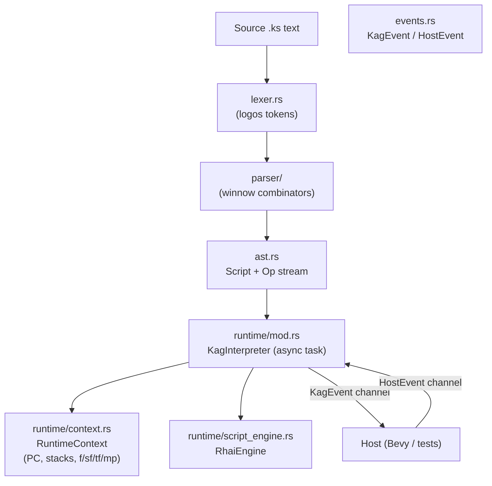

# KAG Interpreter in Rust

## Architecture Overview




## File Layout

```
kag-interpreter/src/
├── lib.rs                  re-exports, public API
├── error.rs                KagError (thiserror + miette Diagnostic)
├── ast.rs                  Script, Op, Tag, Param, TextContent  (Cow<'src,str>)
├── lexer.rs                logos Token enum + tokenize() → Vec<Spanned<Token>>
├── parser/
│   ├── mod.rs              parse_script() entry, winnow stream type alias
│   ├── line.rs             line-level grammar (comment, label, @tag, text)
│   └── tag.rs              tag-name + parameter grammar
├── events.rs               KagEvent, HostEvent, ChoiceOption, VarScope
└── runtime/
    ├── mod.rs              KagInterpreter actor, spawn(), public channel API
    ├── context.rs          RuntimeContext: PC, call/if/macro stacks, variables
    ├── executor.rs         execute_op() + per-tag dispatch
    └── script_engine.rs    RhaiEngine (Engine + Scope, exposes f/sf/tf/mp)
```

## Key Design Decisions

### Lexer (`logos`)

`Token` covers every syntactic unit: `Newline`, `Semicolon`, `At`, `Hash`, `Star`, `LBracket`, `RBracket`, `Eq`, `Amp`, `Percent`, `Pipe`, `Backslash`, `DoubleQuoted`, `SingleQuoted`, `Ident`, `Text`, `Whitespace`, `Error`. `tokenize()` returns `Vec<(Token<'_>, SourceSpan)>` and attaches a `miette::NamedSource` for error reporting.

### Parser (`winnow`)

Operates on `&[(Token, SourceSpan)]` as the stream type. Produces `Script<'src>` where all strings are `Cow<'src, str>` (zero-copy borrows from the source). Key parsers:

- `parse_script` → `Vec<Op<'src>>` + `label_map` + `macro_map`
- `parse_line` → comment | block-comment | chara-shorthand | label-def | @tag | text-line
- `parse_tag_params` → `Vec<Param<'src>>`
- `parse_text_line` → `Vec<TextPart<'src>>` (literals + inline `[tag]`)
- `[iscript]`/`[endscript]` consumed into `Op::ScriptBlock(String)` during parse

`Script<'src>` has an `.into_owned() -> Script<'static>` method for the async runtime boundary.

### AST Types (`ast.rs`)

```rust
pub enum Op<'src> {
    Text(Vec<TextPart<'src>>),
    Tag(Tag<'src>),
    Label(LabelDef<'src>),
    ScriptBlock(String),          // [iscript]..[endscript]
}

pub enum ParamValue<'src> {
    Literal(Cow<'src, str>),
    Entity(Cow<'src, str>),        // &expr  (evaluated at runtime)
    MacroParam { key: Cow<'src, str>, default: Option<Cow<'src, str>> },
    MacroSplat,                    // *
}
```

### Events (`events.rs`)

```rust
pub enum KagEvent {
    DisplayText { text: String, speaker: Option<String> },
    InsertLineBreak,
    ClearMessage,
    WaitForClick { clear_after: bool },    // l = false, p = true
    WaitMs(u64),
    Stop,
    Jump { storage: Option<String>, target: Option<String> },
    BeginChoices(Vec<ChoiceOption>),
    VariableChanged { scope: VarScope, key: String, value: rhai::Dynamic },
    Tag { name: String, params: Vec<(String, String)> }, // all non-core tags
    Error(String),
    End,
}

pub enum HostEvent {
    Clicked,
    TimerElapsed,
    ChoiceSelected(usize),
    ScenarioLoaded { name: String, source: String },
}
```

### Runtime Actor (`runtime/mod.rs`)

```rust
pub struct KagInterpreter { /* private */ }

impl KagInterpreter {
    pub fn spawn(script: Script<'static>)
        -> (Self, mpsc::Sender<HostEvent>, mpsc::Receiver<KagEvent>);
    pub async fn run(self);
}
```

`run()` loops: pop next `Op`, call `executor::execute_op()`, send resulting `KagEvent`s, then `await` a `HostEvent` when the op requires host acknowledgment (click waits, timer waits, choice selection).

### Context (`runtime/context.rs`)

- `pc: usize` — current op index
- `call_stack: Vec<CallFrame>` — for `[call]`/`[return]`
- `if_depth: i32` — tracks `[if]` nesting for skip logic
- `macro_stack: Vec<MacroFrame>` — `mp` bindings per macro invocation
- `variables: rhai::Scope<'static>` — holds `f`, `sf`, `tf` as `rhai::Map`; synced into `RhaiEngine` before each eval

### Script Engine (`runtime/script_engine.rs`)

`RhaiEngine` wraps `rhai::Engine` with a persistent `rhai::Scope`. Before evaluating any expression, `f`/`sf`/`tf`/`mp` are pushed into scope from `RuntimeContext`. `eval_bool(expr)` is used for `cond=` parameters and `[if exp=...]`; `eval_to_string(expr)` for `[emb exp=...]`; `exec(script)` for `[eval]` and `[iscript]` blocks.

### Core Tags (handled internally)

`l`, `p`, `r`, `s`, `wait`, `jump`, `call`, `return`, `label`, `if`, `elsif`, `else`, `endif`, `macro`, `endmacro`, `eval`, `emb`, `ignore`, `endignore`, `link`, `endlink`, `glink`, chara shorthand (`#name`)

All other tags → `KagEvent::Tag { name, params }`.

## Dependency Changes

- Add `tokio = { version = "1", features = ["sync", "rt", "macros"] }` to workspace and `kag-interpreter`

## Unit Tests (inline `#[cfg(test)]`)

- `lexer.rs` — tokenize comment lines, tags, quoted strings, entities
- `parser/line.rs` — parse `*label|title`, `@jump storage=foo target=*bar`, text with inline tags
- `parser/tag.rs` — param parsing: unquoted, quoted, `&expr`, `%key|default`
- `runtime/script_engine.rs` — eval bool/string, variable persistence across calls
- `runtime/executor.rs` — if/endif skip logic, macro expansion, call/return stack

