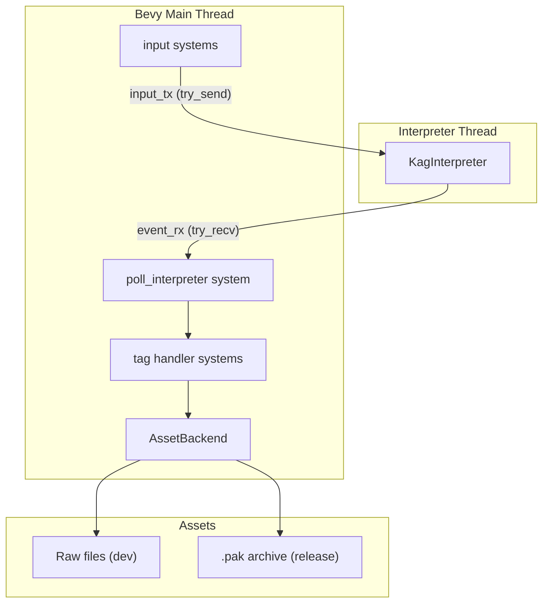

# Runtime Bridge: `kani-runtime`

## Architecture overview




## New workspace crate: `kani-runtime`

Add to `Cargo.toml` workspace `members`:

```toml
[workspace]
members = ["kag-syntax", "kag-interpreter", "kag-lsp", "kani-pak", "kani-runtime"]
```

### `kani-runtime/Cargo.toml` key dependencies

- `kag-interpreter` (path)
- `kani-pak` with feature `bevy` (path)
- `bevy` (full, added to workspace deps)
- `tokio` (workspace, `full` features)
- `anyhow`, `thiserror` (workspace)

---

## 1. Asset abstraction layer — `src/asset.rs`

An `AssetBackend` enum that hides the difference between filesystem (dev) and `.pak` (release):

```rust
pub enum AssetBackend {
    FileSystem { base: PathBuf },
    Pak { reader: Arc<PakReader> },
}

impl AssetBackend {
    /// Synchronously load a text file (used for .ks scenario files).
    pub fn load_text(&self, path: &str) -> anyhow::Result<String> { ... }
    /// Synchronously load raw bytes (fallback; images/audio go via AssetServer).
    pub fn load_bytes(&self, path: &str) -> anyhow::Result<Vec<u8>> { ... }
    /// Register self as a named Bevy asset source ("pak://" or default FS).
    pub fn register_bevy_source(self, app: &mut App) { ... }
}
```

`register_bevy_source` uses the existing `PakAssetReader` for `.pak` mode, or Bevy's default `FileAssetReader` for dev mode. Scenario `.ks` files are loaded via `load_text` synchronously (no Bevy asset pipeline involved), while binary assets (images, audio) go through `AssetServer` using the registered source.

---

## 2. Interpreter threading & bridge resource — `src/bridge.rs`

The interpreter is `!Send` (Rhai uses `Rc`). It runs on a **dedicated OS thread** with a current-thread tokio runtime + `LocalSet`. Communication uses tokio MPSC channels which are `Send`:

```rust
/// Bevy Resource — owned by the main thread.
pub struct InterpreterBridge {
    pub event_rx: mpsc::Receiver<KagEvent>,  // Receiver<T>: Send
    pub input_tx: mpsc::Sender<HostEvent>,   // Sender<T>: Send
    pub state: BridgeState,
}

pub enum BridgeState {
    Running,
    WaitingClick { clear_after: bool },
    WaitingMs { deadline: Instant },
    Stopped,
    WaitingCompletion { tag: String, params: Vec<(String, String)> },
    WaitingChoice,
    WaitingInput { var_name: String },
    WaitingTrigger { name: String },
    Ended,
}
```

`spawn_interpreter(script_path, backend, app)` spawns the OS thread, returns the `InterpreterBridge` resource.

---

## 3. Plugin entry — `src/lib.rs`

```rust
pub struct KaniRuntimePlugin {
    pub asset_backend: AssetBackend,
    pub entry_script: String,  // e.g. "scenario/first.ks"
}

impl Plugin for KaniRuntimePlugin {
    fn build(&self, app: &mut App) {
        // 1. register asset source
        // 2. insert InterpreterBridge resource
        // 3. add Bevy events
        // 4. add systems
    }
}
```

---

## 4. Systems — `src/systems/`

### `poll.rs` — drain `event_rx` each frame

Called in `Update`. Calls `event_rx.try_recv()` in a loop and dispatches:


| `KagEvent` variant                     | Action                                                               |
| -------------------------------------- | -------------------------------------------------------------------- |
| `DisplayText`                          | emit Bevy `EvDisplayText` event                                      |
| `InsertLineBreak`                      | emit `EvInsertLineBreak`                                             |
| `ClearMessage` / `ClearCurrentMessage` | emit clear events                                                    |
| `WaitForClick`                         | set `BridgeState::WaitingClick`                                      |
| `WaitMs(ms)`                           | set `BridgeState::WaitingMs`, record deadline                        |
| `Stop`                                 | set `BridgeState::Stopped`                                           |
| `WaitForCompletion`                    | set `BridgeState::WaitingCompletion`                                 |
| `WaitForRawClick`                      | set `BridgeState::WaitingClick { clear_after: false }`               |
| `InputRequested`                       | set `BridgeState::WaitingInput`, emit Bevy event                     |
| `WaitForTrigger`                       | set `BridgeState::WaitingTrigger`                                    |
| `BeginChoices`                         | set `BridgeState::WaitingChoice`, emit `EvBeginChoices`              |
| `Jump { storage, target }`             | call scenario loader synchronously, send `HostEvent::ScenarioLoaded` |
| `Return { storage }`                   | same as above                                                        |
| `EmbedText`                            | emit `EvEmbedText`                                                   |
| `Trace`                                | log                                                                  |
| `PushBacklog`                          | emit `EvPushBacklog`                                                 |
| `Tag { name, params }`                 | dispatch to tag router (see §5)                                      |
| `End`                                  | set `BridgeState::Ended`                                             |
| `Warning` / `Error`                    | log via Bevy's `warn!` / `error!`                                    |
| `Snapshot`                             | emit `EvSnapshot`                                                    |


### `input.rs` — translate Bevy input → `HostEvent`

Reads `BridgeState` to know what the interpreter is waiting for:

- `WaitingClick` or `Stopped` → on mouse button press: send `HostEvent::Clicked`
- `WaitingMs` → check `Instant::now() >= deadline` each frame, send `HostEvent::TimerElapsed`
- `WaitingCompletion` → send `HostEvent::CompletionSignal` when bevy animation/audio finishes
- `WaitingChoice` → on UI selection: send `HostEvent::ChoiceSelected(idx)`
- `WaitingInput` → on UI confirm: send `HostEvent::InputResult(text)`
- `WaitingTrigger` → on named trigger: send `HostEvent::TriggerFired { name }`

---

## 5. Tag router — `src/systems/tags/`

`KagEvent::Tag { name, params }` is forwarded to a router that matches on `name`:

### `tags/image.rs` — background & layer image tags


| Tag        | Params                                  | Action                                                  |
| ---------- | --------------------------------------- | ------------------------------------------------------- |
| `bg`       | `storage`, `time`, `method`             | load image via `AssetServer`; show as background sprite |
| `image`    | `storage`, `layer`, `x`, `y`, `visible` | spawn/update `ImageLayer` entity                        |
| `layopt`   | `layer`, `visible`, `opacity`           | modify layer entity components                          |
| `free`     | `layer`                                 | despawn layer entity                                    |
| `position` | `layer`, `x`, `y`                       | update sprite transform                                 |


### `tags/audio.rs` — music & sound


| Tag             | Params                                  | Action                               |
| --------------- | --------------------------------------- | ------------------------------------ |
| `bgm`           | `storage`, `loop`, `volume`, `fadetime` | play/crossfade via `AudioPlayer`     |
| `stopbgm`       | `fadetime`                              | fade out + stop BGM                  |
| `se` / `playSe` | `storage`, `buf`, `volume`, `loop`      | play sound effect on numbered buffer |
| `stopse`        | `buf`                                   | stop SE buffer                       |
| `vo` / `voice`  | `storage`, `buf`                        | play voice on voice buffer           |
| `fadebgm`       | `time`, `volume`                        | animate BGM volume                   |


### `tags/transition.rs` — scene transitions


| Tag                  | Params                    | Action                                                     |
| -------------------- | ------------------------- | ---------------------------------------------------------- |
| `trans`              | `method`, `time`, `rule`  | run transition effect, signal `CompletionSignal` when done |
| `fadein` / `fadeout` | `time`, `color`           | alpha animation                                            |
| `movetrans`          | `layer`, `time`, `x`, `y` | translate layer                                            |


### `tags/effect.rs` — screen effects


| Tag     | Action                                                |
| ------- | ----------------------------------------------------- |
| `quake` | camera shake (random offset each frame for `time` ms) |
| `shake` | similar, configurable axis/magnitude                  |
| `flash` | flash screen white/color briefly                      |


### `tags/message.rs` — message window & text style


| Tag                                 | Action                             |
| ----------------------------------- | ---------------------------------- |
| `msgwnd`                            | show/hide/configure message window |
| `wndctrl`                           | resize/reposition window           |
| `resetfont`                         | reset text style to defaults       |
| `font` / `size` / `bold` / `italic` | update current text style          |
| `ruby`                              | set ruby (furigana) annotation     |
| `nowrap` / `endnowrap`              | disable text wrapping              |


### `tags/chara.rs` — character sprites


| Tag                         | Action                                     |
| --------------------------- | ------------------------------------------ |
| `chara`                     | show/update character sprite at named slot |
| `chara_hide` / `chara_free` | hide or despawn character entity           |
| `chara_mod`                 | update sprite variant (expression, pose)   |


---

## 6. Bevy events emitted by the bridge — `src/events.rs`

```rust
#[derive(Event)] pub struct EvDisplayText { pub text: String, pub speaker: Option<String>, pub speed: Option<u64>, pub log: bool }
#[derive(Event)] pub struct EvInsertLineBreak;
#[derive(Event)] pub struct EvClearMessage;
#[derive(Event)] pub struct EvBeginChoices(pub Vec<ChoiceOption>);
#[derive(Event)] pub struct EvInputRequested { pub prompt: String, pub title: String }
#[derive(Event)] pub struct EvEmbedText(pub String);
#[derive(Event)] pub struct EvPushBacklog { pub text: String, pub join: bool }
#[derive(Event)] pub struct EvSnapshot(pub Box<InterpreterSnapshot>);
#[derive(Event)] pub struct EvUnknownTag { pub name: String, pub params: Vec<(String, String)> }
```

Unknown tags that aren't matched by any handler emit `EvUnknownTag` so game-specific code can extend.

---

## File layout

```
kani-runtime/
  Cargo.toml
  src/
    lib.rs            ← KaniRuntimePlugin
    asset.rs          ← AssetBackend enum
    bridge.rs         ← InterpreterBridge resource, BridgeState, spawn logic
    events.rs         ← Bevy event types
    systems/
      mod.rs
      poll.rs         ← drain event_rx, dispatch events
      input.rs        ← Bevy input → HostEvent
      scenario.rs     ← scenario file loading helper
      tags/
        mod.rs        ← tag router
        image.rs
        audio.rs
        transition.rs
        effect.rs
        message.rs
        chara.rs
```

