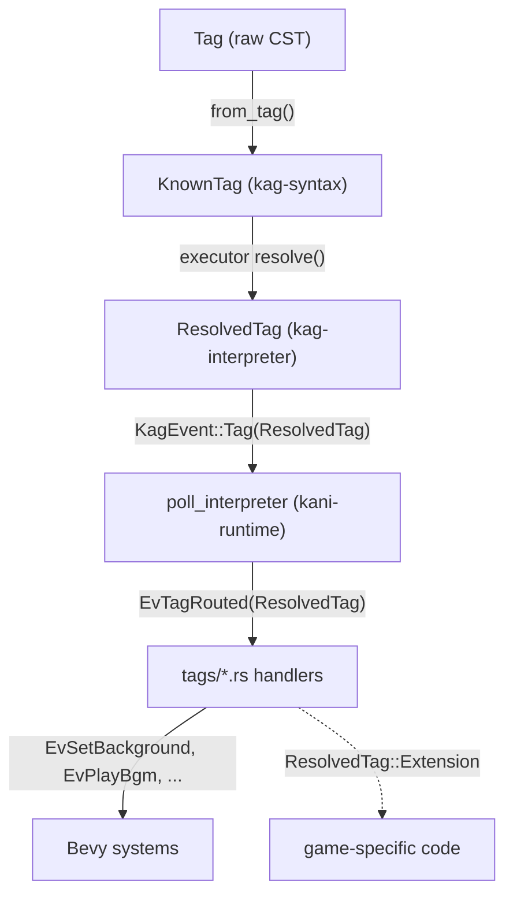

# Step 6: Propagate KnownTag Through Interpreter, Bridge, and LSP

## Context

After steps 1–5, `kag-syntax` provides:
- `KnownTag<'src>` — typed tag enum with `from_tag(&Tag, &mut Vec<SyntaxWarning>) -> Self`
- `TagName` — `Copy` enum with `all()`, `as_str()`, `param_names()`, `doc_summary()`, `from_name()`
- `MaybeResolved<'src, T>` — `Literal(T)` | `Dynamic(ParamValue)`
- All 60+ tags defined via `define_tags!`, including `Extension` for unknowns

The interpreter, bridge, and LSP still use string constants/hardcoded lists. Step 6 wires them up.

## Architecture After Step 6



## Sub-step Order

Steps within each crate can be done independently since each crate compiles on its own.

---

## 6a + 6b — `kag-interpreter` (do together)

### New type: `ResolvedTag` in [`kag-interpreter/src/events.rs`](kag-interpreter/src/events.rs)

Add `ResolvedTag` alongside `KagEvent`. It mirrors `KnownTag` but with all `MaybeResolved<T>` fields collapsed to concrete types:

```rust
pub enum ResolvedTag {
    Bg     { storage: String, time: Option<u64>, method: Option<String> },
    Image  { storage: String, layer: Option<String>, x: Option<f32>, y: Option<f32>, visible: Option<bool> },
    Layopt { layer: Option<String>, visible: Option<bool>, opacity: Option<f32> },
    Free   { layer: Option<String> },
    Position { layer: Option<String>, x: Option<f32>, y: Option<f32> },
    Bgm    { storage: String, looping: bool, volume: Option<f32>, fadetime: Option<u64> },
    StopBgm { fadetime: Option<u64> },
    Se     { storage: String, buf: Option<u32>, volume: Option<f32>, looping: bool },
    StopSe { buf: Option<u32> },
    Vo     { storage: String, buf: Option<u32> },
    FadeBgm { time: Option<u64>, volume: Option<f32> },
    Trans  { method: Option<String>, time: Option<u64>, rule: Option<String> },
    FadeScreen { kind: String, time: Option<u64>, color: Option<String> },
    MoveTrans { layer: Option<String>, time: Option<u64>, x: Option<f32>, y: Option<f32> },
    Quake  { time: Option<u64>, hmax: Option<f32>, vmax: Option<f32> },
    Shake  { time: Option<u64>, amount: Option<f32>, axis: Option<String> },
    Flash  { time: Option<u64>, color: Option<String> },
    MsgWnd { visible: Option<bool>, layer: Option<String> },
    WndCtrl { x: Option<f32>, y: Option<f32>, width: Option<f32>, height: Option<f32> },
    ResetFont,
    Font   { face: Option<String>, size: Option<f32>, bold: Option<bool>, italic: Option<bool> },
    Ruby   { text: Option<String> },
    Nowrap { enabled: bool },
    Chara  { id: Option<String>, storage: Option<String>, slot: Option<String>, x: Option<f32>, y: Option<f32> },
    CharaHide { id: Option<String>, slot: Option<String> },
    CharaFree { id: Option<String>, slot: Option<String> },
    CharaMod  { id: Option<String>, face: Option<String>, pose: Option<String>, storage: Option<String> },
    /// Any tag not in the above list (engine-internal tags forwarded for host info,
    /// or truly unknown game-specific tags). Game code matches on this variant.
    Extension { name: String, params: Vec<(String, String)> },
}
```

Also change two `KagEvent` variants:
- `Tag { name: String, params: Vec<(String, String)> }` → `Tag(ResolvedTag)`
- `WaitForCompletion { tag: String, params: Vec<(String, String)> }` → `WaitForCompletion { which: TagName, canskip: Option<bool>, buf: Option<u32> }`

### Rewrite [`kag-interpreter/src/runtime/executor.rs`](kag-interpreter/src/runtime/executor.rs)

**Delete:**
- All 40+ `const TAG_*: &str` constants (top of file)
- `build_generic_event()` and `build_resolved_params()` (lines 930–957)
- `resolved_str()` and `resolve_u64()` (lines 894–903)

**Add** a generic `resolve<T>` helper that evaluates `Option<MaybeResolved<'_, T>>` against the runtime context:
```rust
fn resolve<T: FromStr + Clone>(
    ctx: &mut RuntimeContext,
    field: Option<MaybeResolved<'_, T>>,
) -> Option<T>
```
For `Literal(v)` → `Some(v.clone())`. For `Dynamic(ParamValue::Entity(expr))` → evaluate via `ctx.script_engine`, parse to `T`. For string attributes, use `AttributeString`'s inner value.

**Add** a minimal `resolve_extension(ctx, tag) -> Vec<(String, String)>` helper for tags that are still forwarded as `Extension` (retains the logic of the old `build_resolved_params`). Used for internal-but-forwarded tags (Link, Ct, Clickskip, CharaPtext, Hch).

**Rewrite `execute_tag()`**: replace `match name { ... }` with `match KnownTag::from_tag(tag, &mut diags)`:
```rust
// Before
match name {
    TAG_BG => { let storage = resolved_str(ctx, tag, "storage"); ... }
    _ => Ok(vec![build_generic_event(ctx, tag)])
}

// After
match KnownTag::from_tag(tag, &mut diags) {
    KnownTag::Bg { storage, time, method } => {
        Ok(vec![KagEvent::Tag(ResolvedTag::Bg {
            storage: resolve_str(ctx, storage).unwrap_or_default(),
            time:    resolve(ctx, time),
            method:  resolve_str(ctx, method).map(|s| s.0.into_owned()),
        })])
    }
    KnownTag::WaitForCompletion { which, canskip, buf } => {
        Ok(vec![KagEvent::WaitForCompletion {
            which,
            canskip: resolve(ctx, canskip),
            buf:     resolve(ctx, buf),
        }])
    }
    KnownTag::Extension { name, params } => {
        Ok(vec![KagEvent::Tag(ResolvedTag::Extension {
            name: name.into_owned(),
            params: resolve_raw_params(ctx, &params),
        })])
    }
    // ... all other variants
}
```

**Rewrite `execute_control_flow()`**: replace `match tag.name.as_ref() { TAG_IF => ... }` with `match KnownTag::from_tag(tag, &mut diags)`.

**Rewrite `is_control_flow_tag()`**: use `TagName::from_name(name).map(|tn| matches!(tn, TagName::If | TagName::Elsif | TagName::Else | TagName::Endif | TagName::Ignore | TagName::Endignore)).unwrap_or(false)`.

**Rewrite `execute_inline_tag()`**: similar switch to `KnownTag` matching.

### Update [`kag-interpreter/src/lib.rs`](kag-interpreter/src/lib.rs)

Add re-exports so `kani-runtime` can use the new types without depending on `kag-syntax` directly:
```rust
pub use kag_syntax::tag_defs::{KnownTag, TagName, MaybeResolved, AttributeString};
pub use events::ResolvedTag;
```

---

## 6c — `kani-runtime`

### Update [`kani-runtime/src/bridge.rs`](kani-runtime/src/bridge.rs)

Change `BridgeState::WaitingCompletion` from `{ tag: String, params: Vec<(String, String)> }` to `{ which: TagName, canskip: Option<bool>, buf: Option<u32> }`.

### Update [`kani-runtime/src/systems/poll.rs`](kani-runtime/src/systems/poll.rs)

- `KagEvent::Tag(resolved_tag)` → `ev_tag.write(EvTagRouted(resolved_tag))`
- `KagEvent::WaitForCompletion { which, canskip, buf }` → `BridgeState::WaitingCompletion { which, canskip, buf }`

### Update [`kani-runtime/src/events.rs`](kani-runtime/src/events.rs)

- `EvTagRouted { name: String, params: Vec<(String, String)> }` → `EvTagRouted(pub ResolvedTag)`
- `EvUnknownTag` can be removed; game code now matches `ResolvedTag::Extension` directly

### Rewrite [`kani-runtime/src/systems/tags/mod.rs`](kani-runtime/src/systems/tags/mod.rs)

- Delete `param()`, `param_f32()`, `param_u64()`, `param_u32()`, `param_bool()` helpers
- Delete `is_known_tag()` and `emit_unknown_tags()`

### Rewrite all tag handler files

Each handler switches from `match tag.name.as_str() { "bgm" => ... }` + `param(p, "key")` parsing to direct destructuring of `EvTagRouted(ResolvedTag::X { ... })`. Example for [`kani-runtime/src/systems/tags/audio.rs`](kani-runtime/src/systems/tags/audio.rs):

```rust
// Before
for tag in reader.read() {
    match tag.name.as_str() {
        "bgm" => { if let Some(storage) = param(p, "storage") { ev_bgm.write(...) } }
    }
}

// After
for tag in reader.read() {
    match tag.0 {
        ResolvedTag::Bgm { storage, looping, volume, fadetime } => {
            ev_bgm.write(EvPlayBgm { storage, looping, volume, fadetime });
        }
        _ => {}
    }
}
```

Same pattern for `image.rs`, `transition.rs`, `effect.rs`, `message.rs`, `chara.rs`.

---

## 6d — `kag-lsp`

### Update [`kag-lsp/src/analysis/completion.rs`](kag-lsp/src/analysis/completion.rs)

Replace `const BUILTIN_TAG_NAMES: &[&str]` with:
```rust
let builtin_names = TagName::all().map(|t| t.as_str());
```

Add parameter-name completions when cursor is inside a tag (a new code path alongside the existing `in_param_value` check):
```rust
// When in tag-name position or completing a param key, offer param names for
// the current tag:
if let Some(tag_name) = TagName::from_name(current_tag_str) {
    for &param in tag_name.param_names() {
        items.push(CompletionItem { label: param.to_owned(), ... });
    }
}
```

### Update [`kag-lsp/src/analysis/hover.rs`](kag-lsp/src/analysis/hover.rs)

Replace `const BUILTIN_TAGS: &[(&str, &str)]` with `TagName` lookups:
```rust
// Before
fn builtin_tag_description(name: &str) -> Option<&'static str> {
    BUILTIN_TAGS.iter().find(|(n,_)| *n == name).map(|(_, d)| *d)
}

// After
fn builtin_tag_description(name: &str) -> Option<&'static str> {
    TagName::from_name(name).map(|tn| tn.doc_summary())
}
```
Also enrich the hover markdown by including `tag_name.param_names()`:
```rust
format!("**tag** `{text}`\n\n{desc}\n\n**Params:** {}", params.join(", "))
```

---

## Key files summary

- [`kag-interpreter/src/events.rs`](kag-interpreter/src/events.rs) — add `ResolvedTag`, change 2 `KagEvent` variants
- [`kag-interpreter/src/runtime/executor.rs`](kag-interpreter/src/runtime/executor.rs) — full rewrite of tag dispatch (~1843 lines, significant change)
- [`kag-interpreter/src/lib.rs`](kag-interpreter/src/lib.rs) — add re-exports
- [`kani-runtime/src/bridge.rs`](kani-runtime/src/bridge.rs) — update `BridgeState::WaitingCompletion`
- [`kani-runtime/src/systems/poll.rs`](kani-runtime/src/systems/poll.rs) — update event matching
- [`kani-runtime/src/events.rs`](kani-runtime/src/events.rs) — change `EvTagRouted`, remove `EvUnknownTag`
- [`kani-runtime/src/systems/tags/mod.rs`](kani-runtime/src/systems/tags/mod.rs) — delete helpers
- [`kani-runtime/src/systems/tags/audio.rs`](kani-runtime/src/systems/tags/audio.rs) — switch to `ResolvedTag`
- [`kani-runtime/src/systems/tags/image.rs`](kani-runtime/src/systems/tags/image.rs) — switch to `ResolvedTag`
- [`kani-runtime/src/systems/tags/transition.rs`](kani-runtime/src/systems/tags/transition.rs) — switch to `ResolvedTag`
- [`kani-runtime/src/systems/tags/effect.rs`](kani-runtime/src/systems/tags/effect.rs) — switch to `ResolvedTag`
- [`kani-runtime/src/systems/tags/message.rs`](kani-runtime/src/systems/tags/message.rs) — switch to `ResolvedTag`
- [`kani-runtime/src/systems/tags/chara.rs`](kani-runtime/src/systems/tags/chara.rs) — switch to `ResolvedTag`
- [`kag-lsp/src/analysis/completion.rs`](kag-lsp/src/analysis/completion.rs) — use `TagName::all()`, add param completions
- [`kag-lsp/src/analysis/hover.rs`](kag-lsp/src/analysis/hover.rs) — use `TagName::doc_summary()`
